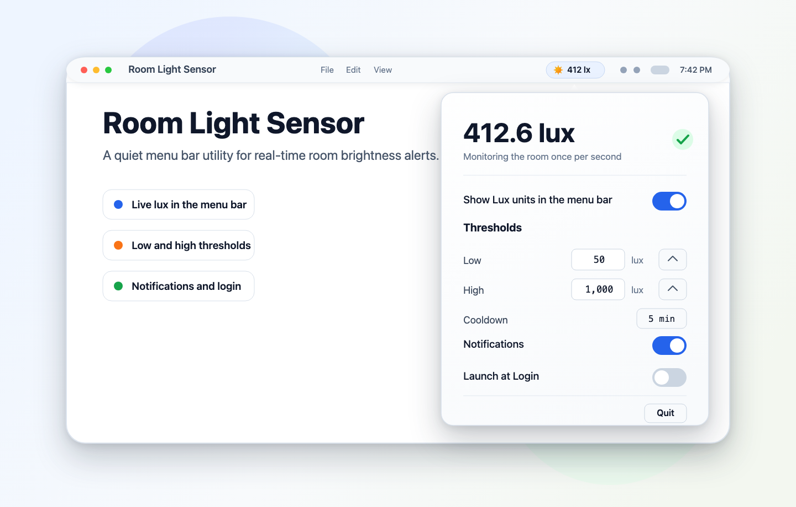

# Room Light Sensor

[](https://github.com/hoodaSaurabh/room-light-sensor/actions/workflows/ci.yml)
[](https://github.com/hoodaSaurabh/room-light-sensor/releases/latest)
[](LICENSE)

Room Light Sensor is a small native macOS menu bar app that reads your Mac's ambient light sensor, shows the current lux value, and notifies you when the room becomes too dark or too bright.

The app is intentionally simple: it lives in the menu bar, samples once per second, stores settings locally, and does not send any data anywhere.

## Preview



## Features

- Live ambient light readings in lux from the macOS IORegistry `CurrentLux` value.
- Menu bar display with an optional lux label.
- Low and high threshold alerts with hysteresis to avoid noisy repeated notifications.
- Configurable notification cooldown.
- Launch at login support.
- Native Swift, AppKit, and SwiftUI implementation.
- Local-only settings and sensor readings.

## Lightweight by design

Room Light Sensor is built to stay out of the way while it monitors your room lighting. In a local 30-minute profile of the packaged macOS app, sampled once per minute on a MacBook Pro (Mac14,9) running macOS 26.4.1, it used:

| Metric | Median | Peak observed |
| --- | ---: | ---: |
| CPU | 1.5% | 4.8% |
| Memory | 30 MB | 41 MB |

The same run showed no app-specific network sockets in `lsof`. Results can vary by Mac model, macOS version, sensor availability, and notification/menu activity, but the app is designed to remain a small native menu bar utility rather than a background-heavy service.

## Requirements

- macOS 13 Ventura or newer.
- A Mac with an ambient light sensor exposed through IORegistry.
- For development: Xcode or the Xcode command line tools with Swift 5.9 or newer.

Room Light Sensor depends on the real-time ambient light value that macOS exposes as `CurrentLux`. This is available on some MacBook models, but it may not be available on every Mac or future macOS release. If the app cannot find a compatible sensor, the menu bar item shows `No ALS`.

## Download

Download the latest `.dmg` from the [GitHub Releases page](https://github.com/hoodaSaurabh/room-light-sensor/releases/latest).

1. Open the downloaded `.dmg`.
2. Drag **Room Light Sensor.app** into **Applications**.
3. Launch it from Applications.
4. Use the menu bar sun icon to view the current lux reading and adjust thresholds.

If macOS warns that the app cannot be opened because it was downloaded from the internet, open **System Settings > Privacy & Security** and allow the app from there. Fully notarized releases require an Apple Developer ID certificate and notarization profile; local ad-hoc builds are useful for testing, but they are not equivalent to notarized public releases.

## Usage

Room Light Sensor appears as a sun icon in the macOS menu bar.

- Click the menu bar icon to open settings.
- Change the low and high lux thresholds to match your workspace.
- Enable or disable notifications.
- Adjust the alert cooldown to avoid repeated notifications.
- Toggle whether the lux value appears directly in the menu bar.
- Enable **Launch at Login** if you want monitoring to start automatically.
- Choose **Quit** from the popover to stop monitoring.

Closing the popover does not stop monitoring.

## Privacy

Room Light Sensor reads only the ambient light value exposed locally by macOS. It does not collect analytics, write sensor history, use the network, or upload data.

## Build From Source

Clone the repository:

```sh
git clone https://github.com/hoodaSaurabh/room-light-sensor.git
cd room-light-sensor
```

Build and run tests:

```sh
swift build
swift test
```

Run the app from source:

```sh
swift run RoomLightSensor
```

When run with `swift run`, the app starts as a normal development process. Packaged builds use the app bundle metadata in `Resources/Info.plist` and run as a menu bar utility.

## Package a DMG

Use the packaging script to build a `.app` bundle and `.dmg`:

```sh
APP_VERSION="1.0.0" \
BUNDLE_IDENTIFIER="com.yourdomain.RoomLightSensor" \
Scripts/package-app.sh
```

For a public release, sign and notarize with Apple Developer credentials:

```sh
APP_VERSION="1.0.0" \
BUNDLE_IDENTIFIER="com.yourdomain.RoomLightSensor" \
SIGN_IDENTITY="Developer ID Application: Your Name (TEAMID)" \
NOTARY_PROFILE="notarytool-profile" \
Scripts/package-app.sh
```

Environment variables:

| Variable | Description |
| --- | --- |
| `APP_NAME` | Display name for the app bundle. Defaults to `Room Light Sensor`. |
| `APP_VERSION` | App version written into the bundle and DMG filename. Defaults to `1.0.0`. |
| `BUILD_NUMBER` | Build number written into the bundle. Defaults to `1`. |
| `BUNDLE_IDENTIFIER` | Reverse-DNS bundle identifier. Defaults to `com.example.room-light-sensor`. |
| `ARCHS` | Space-separated architectures to build. Defaults to `arm64 x86_64`. |
| `SIGN_IDENTITY` | Developer ID Application certificate. If omitted, the app is ad-hoc signed. |
| `NOTARY_PROFILE` | Optional `xcrun notarytool` keychain profile. If set, the DMG is submitted and stapled. |

The generated DMG is written to `.build/package/Room Light Sensor-<version>.dmg`.

## Project Structure

```text
Sources/RoomLightSensor/          App entry point
Sources/RoomLightSensorCore/      AppKit, SwiftUI, sensor, settings, and alert logic
Tests/RoomLightSensorCoreTests/   Unit tests for monitoring and threshold behavior
Resources/Info.plist              App bundle metadata
Scripts/package-app.sh            Release packaging script
```

## Troubleshooting

**The menu bar shows `No ALS`.**  
Your Mac or macOS version may not expose an ambient light sensor through IORegistry.

**Notifications do not appear.**  
Open **System Settings > Notifications** and allow notifications for Room Light Sensor.

**Launch at Login says approval is needed.**  
Open **System Settings > General > Login Items** and approve Room Light Sensor.

**The app opens but no Dock icon appears.**  
That is expected for packaged builds. Room Light Sensor is a menu bar utility.

## Contributing

Issues and pull requests are welcome. Please keep changes focused, include tests for behavioral changes, and run `swift test` before opening a pull request.

## License

Room Light Sensor is available under the [MIT License](LICENSE).
